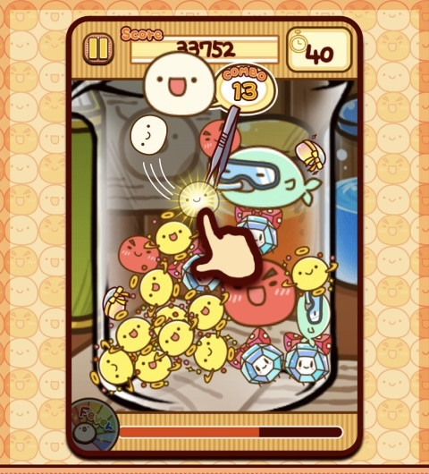
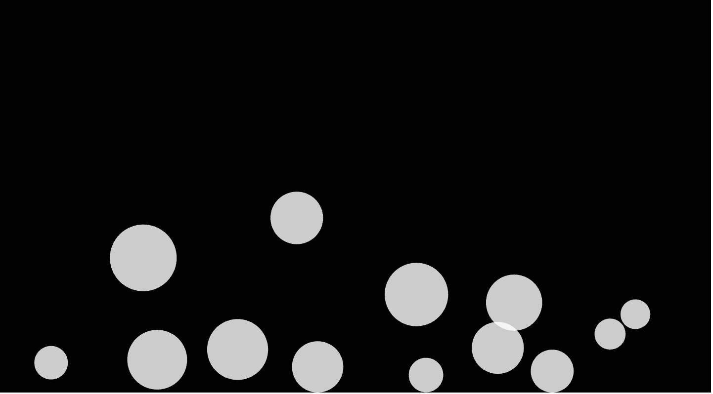

# Imaging Technique Inspiration
## My inspiration comes from a game called TamaTamaLabo. In this game, many cartoon microorganisms collide and bounce off each other in a glass jar. I hope to incorporate this bouncing ball effect into my final project. In the video link below, the collisions between the balls in interactive art also inspired me.In the provided artworks, such as 'Emily Ntange II (Grass)' and 'Wheels of fortune', there are many circular elements. This circle collision effect can enhance the dynamic of the visuals.
### Here are images and the link to illustrate my chosen example

[Link Text](https://www.youtube.com/watch?v=G2ptGCwDkVE)

# Coding Technique Exploration
## This coding technique effectively enables the simulation of multiple balls colliding with each other, as well as the effect of the balls bouncing off the edges. It allows multiple balls to be constrained within a specific range and to interact with each other through collisions. For my upcoming project, I can achieve the desired effects by specifying more precise positions and colors, and by using multiple groups of balls.
### Here are images and the link to illustrate the chosen coding technique

[Link Text]（https://p5js.org/examples/motion-bouncy-bubbles.html）